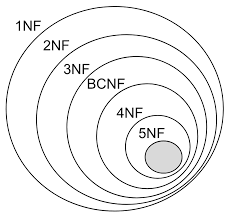
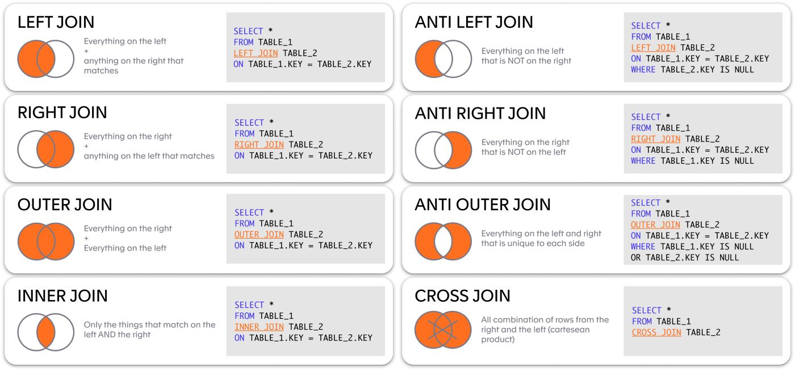
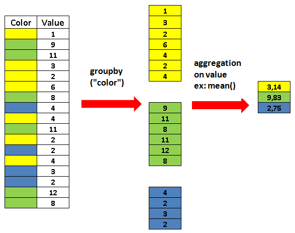
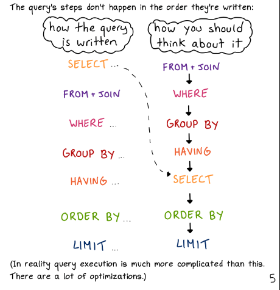
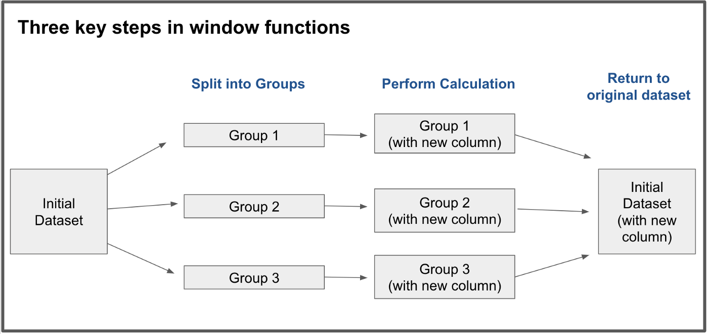

## Table of Contents

- [Chapter 0: The Why](#chapter-0-the-why)
  - [Why Did I Write This Mini-book](#why-did-i-write-this)
  - [Why Learn SQL](#why-learn-sql)

- [Chapter 1: Quick Introduction to Databases](#chapter-1-quick-introduction-to-databases)
  - [Before We Begin](#before-we-begin)
  - [Data Anomalies](#data-anomalies)
  - [Relational Model](#relational-models)
  - [Normalization](#normalization)

- [Chapter 2: Simple SQL (CRUD)](#chapter-2-simple-sql-crud)
  - [How to Setup a Database](#how-to-setup-a-database)
  - [CRUD](#crud)
    - [Create Table](#create-table)
    - [Read Table](#read-table)
    - [Update Table](#update-table)
    - [Delete Table](#delete-table)

- [Chapter 3: Subqueries, Joins, and CTEs](#chapter-3-subqueries-joins-and-ctes)
  - [Tables Setup And More About Relations](#tables-setup-and-more-about-relations)
  - [Subqueries](#subqueries)
  - [joins](#joins)
  - [CTEs](#ctes)

- [Chapter 4: Aggregation](#chapter-4-aggregation)
  - [Basic Aggregations](#basic-aggregations)
  - [Cases](#cases)
  - [Group By](#group-by)

- [Chapter 5: Order Of Execution](#chapter-5-order-of-execution)
  - [Limit and Offset](#limit-and-offset)
  - [Writing vs Execution Order](#writing-vs-execution-order)

- [Chapter 6: Window Functions](#chapter-6-window-functions)
  - [Most Common Window Functions](#most-common-window-functions)
  - [Ordering Before Selecting](#ordering-before-selecting)

- [Closing Notes](#closing-notes)
  - [Constraints and Common Functions](#constrains-and-common-functions)
  - [Databases in Software](#databases-in-software)
  - [What's Next?](#whats-next)

\pagebreak

## Chapter 0: The Why

### Why did I write this?

This mini-book is meant to be an SQL tutorial; it may not be the
most complete SQL book, but it is more concise. It is targeted
towards people who have intermediate understanding of programming. This
means that you know what we mean by functions, data types, keywords,
and control flow (if-statements and loops).

Also, it requires some understanding of what we mean by tables, columns,
rows, and fields. I consider this prerequisite to be trivial, so if you
ever opened a CSV or xlsx file with Excel, or used pandas then we are good to go.

### Why learn SQL?

I believe that SQL is a must-have for anyone whose job involves
dealing with some sort of data; from accountants and data analysts all
the way to ML engineers and software engineers. It is an easy
language, the hard part, in my opinion, is how to approach
writing the query.

In CSE department, the first time you hear about SQL is in the elective Data
Engineering course, and the instructors don't even bother teaching it.
How far you dive into SQL is decided by the TA. SQL is
criminally neglected in my opinion.

After each section, I will include a few exercise questions (with
answers) from some of my favorite websites that I personally use. I
will try to explain the answer and how I came up with it.

Notice that some questions will be harder for you because
they may use a keyword or a function that we are yet to introduce.
Those question will be marked with an asterisk `*`, so feel free to go
directly to the solution without feeling guilty.

\pagebreak

## Chapter 1: Quick Introduction to databases

### What we will learn

- Why not just use excel sheets for everything?
- Data Anomalies
- Relational models
- Basic understanding of normalization

### Before we begin

I want to clarify some things:

- This chapter is perfectly fine to skip **if and only if** you know
  what relational databases are, and why we "normalize" our databases.

- Database is a very broad term. In this mini-book, when we say
  database, we mean relational databases. This may not make sense
  to you for now, but soon we will discuss what the term "relational" means.

- What about other databases that don't use SQL? Most of the time
  the data will be in a relational database. If the database is
  non-relational, there is a chance that it uses SQL-like language.
  Worst case scenario, you won't use SQL syntax, but the way you
  approach writing the query will 90% of the time be the exact same.

- Some frameworks allow you to write SQL queries on normal files,
    instead of databases, like CSV or xlsx files

With that being said, let's start our journey.

#### Why use a database?

1. Databases are more efficient in storing data than your typical CSV or
excel files (There are some exceptions). Excel and Excel-like software applications
have a row limit. For example, Excel has a limit of 1,048,576 rows,
while database software can handle more than 10 billion rows.

2. Databases are made of tables, tables are made of rows (mathematicians
call them tuples), rows are made of fields and fields are just
bytes of data.

3. Databases help catch problems like putting the wrong type in a column
or leaving a field empty. This is particulary helpful when you have
to update or insert rows in the database. We would rather the database raise an error and shout at us than having data
that doesn't make sense and require hours just to clean.

4. Databases implement techniques like partitioning, sharding, and
indexing to optimize operations on the database. These techniques
allow us to search through terabytes of data in less than a second.
You don't need to know what each term of these mean; you can look
them up later if you're interested.

While it may be perfectly fine to keep all your data in a single
table, things may get out of hand pretty quickly. The table can easily
grow to millions of rows, hundreds of columns, and contain thousands of
NULL fields. In such case, updating or querying the table becomes
extremely slow, expensive, and annoying.

### Data Anomalies

Also, at some point, you may encounter what we call "an anomaly". Consider an example
where we have a table of employees and their department.

table:

| employee\_id | department |
|--------------|------------|
|   1          | Finance    |
|   2          | IT         |
|   3          | IT         |
|   4          | Management |

If employee 1 resigns, the entire row will be deleted.

| employee\_id | department |
|--------------|------------|
|   2          | IT         |
|   3          | IT         |
|   4          | Management |

The next day, your boss asks you "how many departments are there?"
(Stupid example, I know. Bear with me). The correct
answer is 3: Finance, IT, and Management. But when you run the query,
you only find 2: IT, and Management. This is called a _Deletion
anomaly_. There are other anomaly types, I encourage you to look them
up with examples.

### Relational models

What is the solution to these problems? The most popular solution is
splitting the table into multiple tables. This is an important concept,
so let's take it slow.

For the previous example, assume we split the table into two tables:
`employees` and `departments`.

employees:

| employee\_id |
|--------------|
|  1           |
|  2           |
|  3           |
|  4           |

departments:

| name       |
|------------|
| Finance    |
| IT         |
| IT         |
| Management |

Now, we need a way to say that employee 1 works in the Finance
department, employee 2 works in IT, and so on. In other words, we want
to create a "relation" between two tables. This is done using
something we call "Keys". Keys are columns that only contain
integers, and their sole job is to connect tables to each others.

Let's assign "keys" to the `department` table.

| key | name       |
|-----|------------|
| 1   | Finance    |
| 2   | IT         |
| 2   | IT         |
| 3   | Management |

Some questions that we can ask here:

- Do keys have to start from 1? No.

- Do keys have to be incremental? No.

- Are keys just an integer that doesn't hold a meaning in the real
world? Most of the time, yes! A case where the Key can hold a meaning
is our Student ID at E-JUST. It is an integer that holds a meaning (faculty ID +
enrollment year + an incremental number) and is totally fine to use as a key.
This is because it is unique for each student and therefore unique for each row.

<!-- I wanted to ask abdeen about the statement below because unique row seems confusing. can we remove it? -->
You will also notice that we assigned the same department the same
key. The key should be **unique** for each unique row.

The IT department exists twice, and you may ask "Can we
just remove one of them?". The answer is Yes.

| key | name       |
|-----|------------|
| 1   | Finance    |
| 2   | IT         |
| 3   | Management |


Assume two rows have n fields (where n is a some positive number),
and they match on n-1 fields and differ on a single field, then they
should have different keys.

Back to the main point, how do we create the relation? Add the key
to the employee table, like so.

| employee\_id | department\_id |
|--------------|----------------|
|  1           | 1              |
|  2           | 2              |
|  3           | 2              |
|  4           | 3              |

And we are done!

Why is this a good idea?

1. It removes all sorts of anomalies. Even if an employee record is
   deleted, the `departments` table is untouched.

2. It simulates the real world and the business model. Meaning that a
   person can look at the relational model and understand a lot about the
   business/company.

3. It saves space. While this is not the primary reason (because the
   saved space is small relative to the size of the tables), it is still
   a positive result. Instead of writing the name of the department
   multiple times, where each single character is a byte,
   we replace it with a string which is a single byte.

The keys that reference another table are called _foreign keys_, the
keys that are referenced are called _primary keys_. These two words will
pop-up again when we talk more about SQL, so remember them.

### Normalization

The process of splitting the table into multiple tables is called
_normalization_. In order to prevent someone from splitting a table
into hundreds of other tables with 2 or 3 columns each, and to make it consistent across databases,
someone came up with rules for normalization called "normal forms".

- 1NF (first normal form)
- 2NF (second normal form)
- 3NF (third normal form)
- BCNF (Boyce-Codd normal form)
- ...

Currently, we are not concerned with how to build the database or the
model; therefore, we will not be talking much about normalization. If
you are interested, you will find hundreds of articles and videos that
explain each form.

"If we are not going to talk about normalization, why even write this
section?"

The main points I want to take from this section is:

- Normalization reduces redundancy and prevents anomalies.
- 98% of the time, normalization is good. So you need to, at least,
  know what it means.
- The most popular form is the 3NF.
- If a database is in BCNF then it is in 3NF. If a database is in
  3NF then it is in 2NF. If a database is in 2NF then it is in 1NF. (Check Diagram below).
- Be sure to read each form thoroughly if you were to design a
  database. You can stop at 3NF, since it is the most popular form.



\pagebreak

## Chapter 2: Simple SQL (CRUD)

### What we will learn

- How to setup a database
- The four basic operations of SQL
  - Create
  - Read
  - Update
  - Delete

### How to setup a database?

To start using a database, you need a DataBase Management System
(DBMS).
There are multiple Relational DataBase Management Systems (RDBMS)
out there. The most popular are SQLite3, PostgreSQL, and MySQL. For
our work, we will use SQLite3, because it requires minimal setup. For
larger projects that require a central database, I would recommend
PostgreSQL (personal favorite) or MySQL.

The keyword in the last statement is "centralized".
SQLite is used in hundreds of popular apps, like WhatsApp (although
encrypted)!

Notice that not all DBMSs are the same. There are differences in the
some available data types, built-in functions and some minor syntax
differences. However, knowing SQL allows you to easily adapt to any
new DBMS.

To get started download DB Browser [**[Download Link](https://sqlitebrowser.org/dl/)**]
for your Operating System.

Once you download and install DB Browser, go ahead and choose "New
Database". Type the name of the file and make sure it ends with the
extension ".db". If a pop-up window called "edit table definition" or "SQLCipher encryption" appears,
close it for now.

Choose the "Execute SQL" tab. A text field will appear on the left
side of the window, this is where we will write our SQL and run it
with `F5` button.

Most of the queries in this mini-book are either to answer a question
or to demonstrate the use of a keyword or a function. The queries that
you should run in your local database will contain a line at the
top like this:

```SQL
-- Run me
```

NOTE: The `--` is one way to write comments in SQL.

### CRUD?

The four main operations of SQL are:

- C: Create table
- R: Read table
- U: Update table
- D: Delete table

We will start with Create and work our way down the list

#### Create table

The first operation we will learn is the create table command. Tables
in most databases have types. If you are familiar with data types in
any other language like Python (int, float, string, array, ...) then this
will be familiar to you. Let's start and write our first SQL query,
create a table called `employees` with a `name` column and an `id`
column.

```SQL
-- Run me
CREATE TABLE employees (
name TEXT,
id INT
);
```

Press F5 and observe the message in the bottom box.

```console
Execution finished without errors.
Result: query executed successfully. Took 0ms
At line 1:
CREATE TABLE employees (
name TEXT,
id INT
);
```

From this small snippet, you will notice a few things:

- The uppercase (all capital) words are keywords in SQL. SQL is not
  case-sensitive, this means that they can be written in lowercase
  and the query will work just fine. However, using uppercase for
  keywords is a convention so that other people who read your query can
  easily distinguish between keywords, column names, table names,
  and so on.

- Defining a column follows the format `[column name] [data type]
  [constraints]`. In the previous example, we didn't put any constraints
  on the columns, but we soon will.

- Queries end with semicolon `;`. While it is not required for when we
  write a single query like the previous example, it is required when
  we write multiple queries at once. Keep in mind that in chapter 6
  we will see a situation where we must omit the semicolon.

- Trying to run the same query again will produce an error. Try it
  yourself and read the error message.

I hear you ask, "What other data types do we have?"

The most used data types are:

- TEXT
- VARCHAR (short for variable-length characters)
- CHAR
- INT
- DOUBLE
- DATETIME
- DATE
- BOOLEAN

You can read more about SQLite3 available data types
**[here](https://www.sqlite.org/datatype3.html).**

Let's insert some rows into the table.

```SQL
-- Run me
INSERT INTO employees VALUES ('Jack',1);
INSERT INTO employees VALUES ('Smith',2);
INSERT INTO employees VALUES ('Dan',3);
```

Try to run those insert statements again without the semicolons at the
end of each line. You will notice that SQL will try to execute all
three as a single query (as if they were a single line)
and therefore will raise an error.

For multiple insertions, we can also do

```SQL
INSERT INTO employees VALUES ('Jack',1), ('Smith',2), ('Dan',3);
```

#### Read Table

Now that we have a table and a few rows, how do we read our data back?

To read, for example, the names (`name` column) of all the employees, we write:

```SQL
-- Run me
SELECT name
FROM employees;
```

You can read the output at the bottom section of the window.

Notice how fast we can conclude that `SELECT` is an SQL keyword while
`name` isn't; because we follow the writing convention! Also, the new
line is just for readability; the query

```SQL
SELECT name FROM employees;
```

works too. We just use newlines because as we progress further, our
queries will have multiple lines, keywords, columns, tables and even
nested queries.

Can you guess the query to read both columns?

```SQL
-- Run me
SELECT
  name,
  id
FROM employees;
```

Note that the order of the columns doesn't matter, we can use either
`name, id` or `id, name`. Also, if we want all the columns, we can use
`*` instead of column names. For example, if we want all the columns
inside the `employees` table, we can say

```SQL
-- Run me
SELECT *
FROM employees;
```

Personally, I prefer writing the columns' names explicitly, because a
code that explains itself is good code. I only use `*` when
exploring data or doing a quick one-time query.

That's great so far, but what if we want a certain subset and not all
the rows? We can filter rows using the `WHERE` keyword. For example,
If we only want the employee with ID 3, we write:

```SQL
-- Run me
SELECT name
FROM employees
WHERE id = 3;
```

A few things to note about `WHERE`:

- The column that we apply the filter on, `id` in this case, doesn't
  have to appear in the `SELECT`; it can, but it is not a must.

- We use `=` instead of `==`, because we can't assign values to
  variables in SQL (some DBMSs allow variables though).

- There are your usual operators like:
  - Less than or equal `<=`
  - More than or equal `>=`
  - Not Equal `!=`, which can also be written as `<>`. Why `<>`? I
    honestly don't know.

- There are other operators that we will mention when we play with
  more types.

A few things to note about `SELECT`:

- Column names should NEVER contain whitespaces, because then we will
  have to put column names inside double quotations (" "). That makes
  the code 10x more annoying to write and even more annoying to read.
  Same applies to table names. You should use an underscore ( \_ ) instead.

- Column names and tables should not contain any uppercase letters.
  As we mentioned before, SQL is not case-sensitive. If you create
  a column `Name` and try to query `Name`, SQL will convert it to
  lowercase (`name`), and will raise an error. You can use
  double quotations (`"Name"`) to prevent that. While this works,
  it can become annoying for the person writing the query and
  the person reading it, so we just avoid the hassle and use all
  lowercase names.

- Unlike other popular languages like Python, there is a difference
  between double and single quotations. Double quotations are used for
  column or table names, single quotations are used for strings (Note
  how we inserted values in the table and which quotations we
  used). To make this easier to remember, I like to think that
  since column names and table names are more important than
  single strings, we put more emphases on them by using
  double quotations.

- `SELECT` can be used to print values directly to the console. Try
  running each of the following lines separately.

  ```SQL
  -- Run me
  SELECT 1;
  -- Run me
  SELECT 'a string';
  -- Run me
  SELECT 1 > 2;
  -- Run me
  SELECT true;
  -- Run me
  SELECT false;
  ```

#### Questions: Select

- If a question is marked with a `*`, feel free to jump directly to the answer as it may
contain ideas that we haven't discussed yet. You are welcome to attempt the question on your own though.

1. **[Query cities](https://www.hackerrank.com/challenges/select-by-id/problem?isFullScreen=true)**
2. **[Attributes of Japanese cities](https://www.hackerrank.com/challenges/japanese-cities-attributes/problem?isFullScreen=true)**
3. **[Populated American cities \*](https://www.hackerrank.com/challenges/revising-the-select-query-2/problem?isFullScreen=true)**
4. **[Employees in alphabetical order \*](https://www.hackerrank.com/challenges/name-of-employees/problem?isFullScreen=true)**
5. **[Employees in increasing ID](https://www.hackerrank.com/challenges/salary-of-employees/problem?isFullScreen=true)**
6. **[Unfinished Parts \*](https://datalemur.com/questions/tesla-unfinished-parts)**

#### Answers: Select

1. We start by asking "what columns do we need?". The answer is in the
  question "Query all columns".

    Second we ask "Are all the columns in a single table?". The answer is
    yes. In the next chapter, we will talk about what to do if the
    answer to this question is no.

    Since we need all columns, we can simply do `SELECT *`

    ```SQL
    SELECT *
    FROM city
    WHERE id = 1661;
    ```

2. What columns do we need? The question says "all attributes"
    (attributes is another name for column).

    Are all the columns in a single table? Yes.

    ```SQL
    SELECT *
    FROM city
    WHERE countrycode = 'JPN';
    ```

    Notice how we put the string JPN inside single quotations. If we
    remove them, then SQL will think JPN is a column name and not a
    string (You can perform operations on two columns, we will see how and why soon).
    Also notice that because we used quotations, SQL doesn't change JPN to jpn.

3. We ask the same questions. This time we find that we only need a
   single column. However, we have 2 conditions, an American city, and
   population > 120,000. We can achieve this by using the AND
   operator.

     ```SQL
     SELECT name
     FROM city
     WHERE
        countrycode = 'USA' AND
        population > 120000;
     ```

    If you guessed that SQL also has an `OR` operator, you'd be
    correct.

4. For this question, we introduce a new keyword `ORDER BY`. It can
   take one or more columns, if given a text column it sorts it
   alphabetically. The default order is ascending order, this means
   that you can safely remove the `ASC`.

    ```SQL
    SELECT name
    FROM employee
    ORDER BY name ASC;
    ```

    You can reverse the order by using putting `DESC` after the column
    name.

5. Now we see how we can use both `ORDER BY` and `WHERE`.

    ```SQL
    SELECT name
    FROM employee
    WHERE
      months < 10 AND
      salary > 2000
    ORDER BY employee_id;
    ```

    Notice that `ORDER BY` must come after the `WHERE`. If we swap
    their order in the query, we will get an error. Also notice that `employee_id`
    doesn't have to appear in the selected columns. We will know why
    when we talk about Order of Execution in Chapter 5.

6. In this question we will meet our first built-in function called
   `DISTINCT`, we will also meet the `IS` operator.

     The idea is that we want the parts with no `finish_date`. This
     means that the field is NULL. We assume you understand the
     difference between NULLs and empty strings.

     To compare NULLs, we can't use `=` operator; instead, we use `IS`.

     ```SQL
     SELECT part
     FROM parts_assembly
     WHERE finish_date IS NULL;
     ```

     However, when we run the above query, we get an incorrect answer.
     This is because our answer contains a duplicate row. To remove
     duplicates, SQL provides a function called `DISTINCT`.

     The final answer will be:

     ```SQL
     SELECT DISTINCT(part)
     FROM parts_assembly
     WHERE finish_date IS NULL;
     ```

     NOTE: `DISTINCT` can take more than a single column. In such case,
     SQL removes a row if and only if all the mentioned fields are
     duplicates of another row's fields.

#### Update Table

The update syntax is fairly easy. Assume the employee `Jack` wants to
change his id from 1 to 5. We simply use the query:

```SQL
-- Run me
UPDATE employees
SET id = 5
WHERE name = 'Jack';
```

Just like in `SELECT`, `WHERE` can use other operators like: `>=`,
`!=`, `AND`, etc ...

If we omit the `WHERE`, we update the entire id column and set it to
5, so be careful with your updates.

#### Delete Table

Delete is also very straightforward. To delete a row we use:

```SQL
-- Run me
DELETE FROM employees
WHERE id = 2;
```

Since we are done with this chapter, go ahead and
delete the `employees` table. Use the query:

```SQL
-- Run me
DROP TABLE employees;
```

There is a keyword to delete, add, or modify columns, but we won't be
covering it here. I mention that because in case you forget a column
or use the wrong data type while creating a table,
you don't have to delete the entire table and start over.

NOTE: Most databases provide a `TRUNCATE` keyword, which is used to
delete all rows but keep the table. While you can delete all rows by using
`DELETE` without a `WHERE`, `TRUNCATE` is more efficient.

\pagebreak

## Chapter 3: Subqueries, Joins, and CTEs

### What we will learn

- Dealing with relational tables
- Subqueries
- Join and its types
- Common Table Expressions (CTEs)

In this chapter, we discuss databases with multiple tables. Because
this is where I see most people struggle, we will try to walk through
it slowly and explain with extra care.

The idea of Joins, subqueries and CTEs is that your `SELECT`
can only run on a single table, so what do we do if we need columns
from multiple tables? We can query a table, then use the result of
that query in another query. We can also put the tables side-by-side,
and glue them together to create one big single table.

Let's go back to the example we used in the first chapter.

departments:

| id  | name       |
|-----|------------|
| 1   | Finance    |
| 2   | IT         |
| 3   | Management |

employees:

| employee\_id | department\_id |
|--------------|----------------|
|  1           | 1              |
|  2           | 2              |
|  3           | 2              |
|  4           | 3              |

To be able to know who works in the IT department, for example, we have
two possible approaches:

For the first approach, we will need to know:

  1. The ID of the department

  2. The employees who work for that department ID

Each of these is a separate query.

For the second approach we can put them side-by-side and match
the `department_id` columns.
This will produce the following table:

| employee\_id | department\_id | name       |
|--------------|----------------|------------|
|  1           | 1              | Finance    |
|  2           | 2              | IT         |
|  3           | 2              | IT         |
|  4           | 3              | Management |

Now we can query the table directly like we did in the last chapter.

We will start with the first approach, then the second, and finally an
approach that combines both.

### Tables Setup and More About Relations

Before we begin, we need to create both `employees` and
`departments` tables in our database. Remember to drop the `employees`
table that we created in the previous chapter.

Departments:

```SQL
-- Run me
DROP TABLE IF EXISTS employees;

-- Can also use `CREATE TABLE IF NOT EXISTS`
-- notice the `PRIMARY KEY` and `AUTOINCREMENT` constraints on id column
CREATE TABLE departments (
id INTEGER PRIMARY KEY AUTOINCREMENT,
name VARCHAR(12)
);

INSERT INTO departments(name)
VALUES('Finance'),('IT'),('Management');
```

The `VARCHAR` type means that each field in this column can have up to
12 characters. If we insert more than 12, the database will raise an error.

Notice how we used `VARCHAR` instead of `TEXT`. `TEXT` means that
we don't know the size of our data; therefore, we ask the database to
adapt when we insert data in that column. Generally speaking,
using `CHAR` and `VARCHAR` is more efficient than using `TEXT`.
So, try to use `CHAR` and `VARCHAR`, and avoid `TEXT`, when
possible.

Notice that this time, we put constraints on the columns. We briefly
discussed Primary Keys in [chapter 1](#relational-models). The `PRIMARY
KEY` constraint implies that the column MUST be unique and not NULL.
A table can have multiple unique columns, but only one primary key.

This is not a crucial piece of information for out journey, but I have to
clarify it: A table can only have a one primary key, but that one primary
key can be a combination of columns.

The `AUTOINCREMENT` constraint means that we don't have to include
the a value for the `id` column in our inserts, the database will
automatically assign incremental IDs starting from 1.

Since our inserts only populate certain fields, we need to tell SQL
which fields these values are for. That's why we need to include
`(name)` after table name in our inserts.

Now, select the rows from the departments table and observe the `id`
column.

```SQL
-- Run me
SELECT *
FROM departments;
```

Now to create the `employees` table:

```SQL
-- Run me
CREATE TABLE employees (
id INTEGER PRIMARY KEY AUTOINCREMENT,
name TEXT,
department_id INT,
FOREIGN KEY(department_id) REFERENCES departments(id)
);
```

Here we find a new constraint; the `FOREIGN KEY`. This just means that
this column references another column in another table. This may seem
insignificant, but it prevents us from changing a referenced value.

For example, assume that Jack works for the Finance department (ID 1).
Someone changes the ID of the Finance department from 1 to 4. Now,
when we ask "what department does the employee
named 'Jack' work for?", we get the answer `NULL`, because there is no
department with the ID 1 anymore. Foreign keys will raise an error on some
operations, like update and delete, to prevent such scenarios.

Inserting into `employees` table is a bit harder, because we need to
know the `id` of the department (not its name) before inserting. A possible solution
is keep a small sticky note in front of your desk that contains each
department with its ID. Obviously, this is not optimal at all. How do
we solve this?

### Subqueries

Think of subqueries as nested function calls or method-chaining in your favorite
programming language.

Won't it be easier if we have a function that we pass the department
name to and it returns the id? Something like:

```SQL
/* get_me_id is not a valid function and
therefore this is not a valid SQL query*/
INSERT INTO employees(name, department_id)
VALUES('Jack', get_me_id('Finance'))
```

NOTE: As we mentioned earlier, `--` are comment lines in SQL. We can
also do `/* */` for multi-line comments.

In SQL, we can't define a function like `get_me_id`; however, we can
replace it directly with its definition. What query returns the ID of a
department?

```SQL
SELECT id
FROM departments
WHERE name = INSERT_DEPARTMENT_NAME_HERE;
```

We take this subquery and use it instead of the `get_me_id_
function in the insert statement.

```SQL
-- Run me
INSERT INTO employees(name, department_id)
VALUES('Jack', (
                SELECT id
                FROM departments
                WHERE name = 'Finance'
              )
);
```

What SQL does is that it starts evaluating the innermost queries first.
So it evaluates the `SELECT` query and returns the value to the
`INSERT` query.

The intermediate query, after evaluating the `SELECT`, and before the
`INSERT`, is:

```SQL
INSERT INTO employees(name, department_id)
VALUES('Jack', 1);
```

which is exactly what we wanted to achieve.

Nesting queries inside other queries is called "Subqueries". The above
query works because the subquery returns only a single value.

In case the subquery returns more than 1 value, the insert query will
either return an error because it expects a single integer value
(that's the data type of the `department_id` column), or just take
the first value. The behavior depends on the DBMS of choice. Can you figure out
which behavior does SQLite3 have?

Moreover, if the subquery return more than 1 column, the DBMS will
raise an error, because it expects a single column.

Now, take the same query and insert other employees into the table.

```SQL
-- Run me
INSERT INTO employees(name, department_id)
VALUES('John', (
                SELECT id
                FROM departments
                WHERE name = 'IT'
              )
);

INSERT INTO employees(name, department_id)
VALUES('Dan', (
                SELECT id
                FROM departments
                WHERE name = 'IT'
              )
);

INSERT INTO employees(name, department_id)
VALUES('Chris', (
                SELECT id
                FROM departments
                WHERE name = 'Management'
              )
);
```

Now that we have a few rows to play with, we can use subqueries again
to query our data.

Imagine we are asked to get the names of all employees who work in the
IT department. To solve this using subqueries, we will need to get the `id`
of the IT department. We care about the id because `SELECT` only works on a
single table and the `employees` table only contains `department_id`
but not the department name.

Here, we need to ask some questions:

1. "What columns do we need?". We need two columns:
`name` and `department_id`.However, We need the department `name`
to find `department_id`.

2. "Are all the needed columns in one table?". The
answer is No! We need employee's `name` and we will use department
`name` to find the corresponding `department_id`.

What is the query to get the id of a department?

```SQL
SELECT id
FROM departments
WHERE name = 'IT';
```

Take this query and shove it inside the other `SELECT` query.

```SQL
-- Run me
SELECT name
FROM employees
WHERE department_id = (SELECT id
                       FROM departments
                       WHERE name = 'IT'
                       );
```

What if we need all employees who work in either IT or Finance? The subquery will
return an array, not a single value. This is completely OK, we only
need to change the operator from `=` to `IN`. `IN` evaluates to
`True` if the value exists in the array.
This means that if the employee's `department_id` is found inside the
returned array, we return that employee's name.

```SQL
-- Run me
SELECT name
FROM employees
WHERE department_id IN (SELECT id
                       FROM departments
                       WHERE name = 'IT' OR name = 'Finance');
```

In case you are asking, you can hardcode an array too. Something like:

```SQL
-- Run me
SELECT name
FROM employees
WHERE department_id IN (1,2);
```

Hardcoding arrays can be handy sometimes, as we will see in one of the
questions later on.

NOTE: You can also exclude some values using `NOT IN` operator.

#### Questions: Subquery

1. **[Pages With No Likes](https://datalemur.com/questions/sql-page-with-no-likes)**
2. **[African Cities](https://www.hackerrank.com/challenges/african-cities/problem?isFullScreen=true)**

#### Answers: Subquery

1. First, we need to know which pages have at least a single like. This means
   that the page exists at least once in the `page_likes` table, right? Let's
   get a list of these first.

   ```SQL
   SELECT page_id
   FROM page_likes;
   ```

   Now we need a list of all the pages. This is obviously not in the
   `page_likes`, because we know that some pages may not have any
   likes.

   The solutions will be:

   ```SQL
   SELECT page_id
   FROM pages
   WHERE page_id NOT IN (
                        SELECT page_id
                        FROM page_likes
                       );
   ```

   If you look at the "solution" tab in the website, you will find 3
   other answers. Don't pay too much attention to the first one, we
   will talk about joins in the next section.

2. The question gives us the hint that column `CountryCode` of table
   `city` is a foreign key that references column `code` of table
   `country`. We use the notation `table.column` to say
   that `column` exists in `table`.

   First get the code of all African countries.

   ```SQL
   SELECT code
   FROM country
   WHERE continent = 'Africa'
   ```

   Put it inside another `SELECT` query.

   ```SQL
   SELECT name
   FROM city
   WHERE countrycode IN (
                         SELECT code
                         FROM country
                         WHERE continent = 'Africa'
                         );
   ```

  Notice how we used `IN` instead of `=`. This is because the return of
  the subquery is not a single value.

### Joins

Joins is the second approach we discussed. The idea is to put tables
side-by-side and query one big table. The only thing we need is to
know which columns to merge the tables on. Most of the time,
we match on primary and foreign keys, because these make the most sense.
That's why knowing the foreign keys and the primary keys makes our life
much easier when writing queries.

To demonstrate, run the following query:

```SQL
-- Run me
SELECT *
FROM employees
JOIN departments
ON employees.department_id = departments.id
```

There are many join types, the one we just used is called an `INNER JOIN`, which
is the default join SQL uses when we don't specify a type. I prefer including
the type for clarity.

#### Inner Joins

Before we continue, let's insert some more rows.

```SQL
-- Run me
INSERT INTO departments(name) VALUES('maintenance');
INSERT INTO employees(name) VALUES ('Robin');
```

Question: Re-run the previous join query again and observe the output.
Why is it the same as before?

Answer: Joins have types. The default type (which we used) is called
an inner join. It matches each value from the first column
(employees.department\_id) with a value in the
second column (department.id). If a value in the first column doesn't
exist in the second column, SQL ignores the entire row. The same
happens if a value in the second column is not found in the first
column.

This means if for example, we delete the employee named 'Jack',
(the only employee in the Finance department) and re-run the join query,
the Finance department will not appear in the result table.

As mentioned before, inner joins are the most common in real world
scenarios.

I hear you ask, "What other joins are there?"

#### Left (Outer) Join

The left join (sometimes called left outer join) does the exact same
thing as an inner join; however, if the a value in the first column
doesn't have a match in the second column, it joins that row with
NULLs.

This can be useful if we need to know those who don't have a
department.

At the end of this section, we will solve a question using a left
join.

Run the following query and observe the result:

```SQL
-- Run me
SELECT *
FROM employees
LEFT JOIN departments
ON employees.department_id = departments.id;
```

Notice the last row in the output. It has an NULL values!

You may have noticed that we can create an inner join from a
left join. Try to give it a try on your own before continuing.

```SQL
-- Run me
SELECT *
FROM employees
LEFT JOIN departments
ON employees.department_id = departments.id
WHERE departments.id IS NOT NULL;
```

#### Right (Outer) Joins

You may have guessed it by now. Right join does the same thing as a
left join, if you swap the order of the tables.

This means that the two following queries are equivalent.

```SQL
-- Run me
SELECT *
FROM employees
LEFT JOIN departments
ON employees.department_id = departments.id;
```

```SQL
SELECT *
FROM departments
RIGHT JOIN employees
ON employees.department_id = departments.id;
```

My current version of DB Browser doesn't support Right Joins. But you
can take my word for it that they are equivalent.

#### Full Outer Join

This is a combination of both left and right joins. Basically, if any
value in either columns doesn't have a match, SQL will output NULLs.

```SQL
SELECT *
FROM departments
OUTER JOIN employees
ON employees.department_id = departments.id;
```

#### Cross Join

Cross joins basically matches each row from the first table with every
row in the second table.

Try to run the following query and observe the output.

```SQL
SELECT *
FROM departments
CROSS JOIN employees;
```

You will notice that we don't need to match on a column and therefore
we removed the `ON` keyword.

If first table contains N rows, and the second table contains M rows,
then the output of a cross join will have N x M rows.

Mathematically, this is one of the 5 fundamental operations that can
create any other query. However, it is rarely used in practice.

Notice how we need to refer to the `table.column` in the `ON`,
we write the name of the table again. SQL provides a more concise
way with table aliases. For example, the left join query can be
rewritten as:

```SQL
SELECT *
FROM employees AS e
LEFT JOIN departments AS d
ON e.department_id = d.id
WHERE d.id IS NOT NULL;
```

And while we are at it, columns can have aliases too. We will use that
in the next chapter.

One last thing before we start with the questions.
Here is a diagram that summarizes joins and their usages.



#### Questions: Joins

1. **[Pages With No Likes](https://datalemur.com/questions/sql-page-with-no-likes)**
2. **[African Cities](https://www.hackerrank.com/challenges/african-cities/problem?isFullScreen=true)**

#### Answers: Joins

1. This is a question that requires an outer join, because we still
   want the rows that don't have a match in the second table. In fact,
   those rows are the ones we need.

    ```SQL
    SELECT DISTINCT(p.page_id)
    FROM pages AS p
    LEFT JOIN page_likes AS l
    ON p.page_id = l.page_id
    WHERE l.page_id IS NULL
    ORDER BY p.page_id;
    ```

    We use `ORDER BY` because the question asked for the results to be
    in an ascending order, and just to be safe we use `DISTINCT`.
    Notice that `DISTINCT` is discouraged because it is an expensive
    operation, so try to use it only when necessary.

2. This should be straightforward by now.

    ```SQL
    SELECT city.name
    FROM city
    JOIN country
    ON city.countrycode = country.code
    WHERE country.continent = 'Africa';
    ```

### CTEs

Common Table Expressions (CTEs) are temporary tables that exist only
for the duration of a single query. It is that simple.
Why is it useful? Because:

1. Sometimes we need a temporary table to
join on.
2. They are more readable than subqueries.
3. They have some performance advantages, read below.

Does that mean that subqueries are bad? Not at all. Subqueries are
good for ad-hoc (one-time on-the-fly) queries, and are usually
quicker to write than CTEs. However, in the case that we need to write
the same subquery twice, CTEs are a better alternative.

SQL engines try to optimize your query as much as possible before
running it. Most engines don't realize that two subqueries are the
exact same until they finish executing both of them; this means
double the work and double the time.

Also, for more complex queries that require multiple subqueries, or
even a single complex subquery, CTEs are much more readable and have
the same cost.

In the next chapter, we will use CTEs a lot, and you will see that
replacing the CTEs with subqueries would make the query harder to
understand.

Run the following query:

```SQL
-- Run me
-- notice the missing ';' after the CTE, as this MUST run as a single query.
WITH temporary_table AS (
  SELECT *
  FROM employees AS emp
  JOIN departments AS dep
  ON emp.department_id = dep.id
)

SELECT *
FROM temporary_table;
```

#### Questions: CTEs

1. **[Pages With No Likes](https://datalemur.com/questions/sql-page-with-no-likes)**
2. **[African Cities](https://www.hackerrank.com/challenges/african-cities/problem?isFullScreen=true)**

#### Answers: CTEs

1. This is an example where using a CTE can make things more
   complicated. It is better to use a join or a subquery.

    ```SQL
    WITH joined_data AS (
      SELECT
        p.page_id AS pages1,
        pl.page_id AS pages2
      FROM pages AS p
      LEFT JOIN page_likes AS pl
      ON p.page_id = pl.page_id
    )

    SELECT pages1
    FROM joined_data
    WHERE pages2 IS NULL;
    ```

    We can also answer with:

    ```SQL
    WITH liked_pages AS (
      SELECT page_id
      FROM liked_pages
    )

    SELECT page_id
    FROM pages
    WHERE page_id NOT IN (SELECT page_id FROM liked_pages);
    ```

    Quick side note: In the first example, try to remove the
    aliases from the CTE and check the columns' names.

    ```SQL
    WITH joined_data AS (
      SELECT
        p.page_id,
        pl.page_id
      FROM pages AS p
      LEFT JOIN page_likes AS pl
      ON p.page_id = pl.page_id
    )

    SELECT *
    FROM joined_data;
    ```

    Check the names of the columns. Will you be able to query them?
    Give it a shot.

2. By now, the approach should be straightforward.

  ```SQL
  WITH african_codes AS (
    SELECT code
    FROM country
    WHERE continent = 'Africa'
  )

  SELECT city.name
  FROM city
  JOIN african_codes AS ac
  ON ac.code = city.countrycode;
  ```

  Notice how the CTE doesn't end in a semicolon. Semicolon mark the
  end of the query, if we were to put a semicolon after the CTE, it
  will be dropped immediately and won't be available for the
  second part of the query.

  We can also do:

  ```SQL
  WITH african_codes AS (
    SELECT code
    FROM country
    WHERE continent = 'Africa'
  )

  SELECT name
  FROM city
  WHERE code IN (SELECT code FROM african_codes);
  ```

This concludes this chapter. The more you understand about databases
and how they store and process the data, the more you will be able to
decide whether to use CTEs, subqueries or joins. For our use cases,
any of them will do just fine.

\pagebreak

## Chapter 4: Aggregation

### What we will learn

- Aggregation functions
- Cases (SQL equivalent to if-statements)
- Grouping rows

### Basic Aggregations

Aggregations in SQL are very easy. We will start by adding a `salary`
column to our `employees` table.

```SQL
-- Run me
ALTER TABLE employees
ADD salary INT;
```

If we check out our table, we will see that the `salary` column is
NULL. Let's put some values in it.

```SQL
-- Run me
UPDATE employees
SET salary = 3000
WHERE id = 1;

UPDATE employees
SET salary = 5000
WHERE id = 2;

UPDATE employees
SET salary = 3000
WHERE id = 3;

UPDATE employees
SET salary = 4000
WHERE id = 4;

UPDATE employees
SET salary = 2000
WHERE id = 5;
```

We will start with the basic aggregation functions. Try each of the
following queries separately.

```SQL
-- Run me
SELECT MAX(salary)
FROM employees;

-- Run me
SELECT MIN(salary)
FROM employees;

-- Run me
SELECT AVG(salary)
FROM employees;
```

We can also do basic arithmetic operations, check the following queries
out.

```SQL
-- Run me
SELECT MAX(salary) - MIN(salary)
FROM employees;

-- Run me
SELECT SUM(salary)/COUNT(salary)
FROM employees;
```

Most databases contain more sophisticated aggregation functions.
You can read more about SQLite3 functions
[here](https://www.sqlite.org/lang_aggfunc.html).

### Cases

Cases are like if-statements in your favorite programming language.
While they can be used without aggregation functions, I found that
they go hand-in-hand most of the time.

Imagine we are asked to find the number of employees that work in
department number 2 vs all the other departments. We don't care about
the department name for now.

If the question was total number of employees in department 2, we
could have easily used a `WHERE` like so:

```SQL
-- Run me
SELECT COUNT(*)
FROM employees
WHERE department_id = 2;
```

This clearly doesn't answer our question.

Before answering this question, we need to understand how `CASE`
works.

```SQL
-- Run me
SELECT
  department_id,
  CASE WHEN department_id = 2 THEN 1 ELSE 0 END
FROM employees;
```

Observe the structure of the `CASE` statement and the second column in
the output.

To add more cases we can do:

```SQL
-- Run me
SELECT
  department_id,
  CASE WHEN department_id = 2 THEN 0
       WHEN department_id = 3 THEN 1
       ELSE -1 END
FROM employees;
```

Just please don't forget the `END` after writing all your cases.

How to use this to answer our question? We can do the following:

```SQL
-- Run me
SELECT
  SUM(CASE WHEN department_id = 2 THEN 1 ELSE 0 END),
  SUM(CASE WHEN department_id != 2 THEN 1 ELSE 0 END)
FROM employees;
```

I realize that it may not be clear by now. Hopefully, these questions
will help you more.

#### Questions: Cases and aggregation

1. **[Laptop Vs Mobile](https://datalemur.com/questions/laptop-mobile-viewership)**
2. **[Compressed Mean \*](https://datalemur.com/questions/alibaba-compressed-mean)**
3. **[Japan Population](https://www.hackerrank.com/challenges/japan-population/problem)**
4. **[Manhattan Distance](https://www.hackerrank.com/challenges/weather-observation-station-18/problem?isFullScreen=true)**
(Make sure to change the engine to MySQL or Oracle.)
5. **[Capital Gain Loss](https://leetcode.com/problems/capital-gainloss/submissions/904935018/)**

#### Solutions: Cases and aggregation

1. This is similar to the question we asked in the section.

    First we need to filter each row twice. The first filter is to get all rows
    that use tablets or phones. The second filter is the rows that
    contain laptop only.

    We have been successful in filtering rows with
    `WHERE` for a few sections. However, this is different because we
    need to do it twice.

     ```SQL
     -- notice the hardcoded arrays
    SELECT
      SUM(CASE WHEN device_type = 'laptop' THEN 1 ELSE 0 END) AS laptop_views,
      SUM(CASE WHEN device_type IN ('phone', 'tablet') THEN 1 ELSE 0 END) AS mobile_views
    FROM viewership;
     ```

     Notice how the condition would have been the exact same if we
     have used a `WHERE`. The `ELSE` can also return an NULL, but I
     prefer 0 to avoid unusual behavior in other engines (Some
     engines count NULLs).

     NOTE: You can solve this question without `CASE`; however, it
     won't be neither efficient nor clean.

2. The solution is straightforward. First we need to calculate the
   average and then round it to 1 decimal. We can't use the `AVG`
   function because each row represents count of items; we must do it
   by hand.

   First, we try to find the average:

   ```SQL
   SELECT
    SUM(item_count*order_occurrences)/SUM(order_occurrences)
   FROM items_per_order;
   ```

   If you try this query, you will get an incorrect answer. What went
   wrong? Both columns are integers, but we need the result to be a
   decimal. We should cast either of the columns as a Decimal to get a
   Decimal answer.

   This website uses PostgreSQL engine, so we google how to cast types
   in PostgreSQL and we find the operator `::` (You can google how
   to cast types in SQLite3). We modify our previous query and add the `ROUND`
   function to the query.

   ```SQL
   SELECT
    ROUND(
      SUM(item_count*order_occurrences)::Decimal/SUM(order_occurrences)
        ,1)
   FROM items_per_order;
   ```

3. We want to sum the population of all the Japanese countries.

    ```SQL
    SELECT SUM(population)
    FROM city
    WHERE countrycode = 'JPN';
    ```

4. Manhattan Distance is the sum of absolute difference between two
     points. For example, for points $(x_1,y_1)$ and
     $(x_2,y_2)$, the Manhattan distance would be
     $$ |x_1 - x_2 | + |y_1 - y_2 | $$

   ```SQL
   SELECT
    ROUND(
      ABS(MIN(LAT_N) - MAX(LAT_N)) + ABS(MIN(LONG_W) - MAX(LONG_W))
    ,4)
   FROM station;
   ```

5. For this question, we want to sum the price if the operation is a buy, and
   subtract the price if the operation is a sell. This sounds like a `CASE`.

   Since the operation takes 2 strings only (`'buy'` and `'sell'`) we can
   write a single case for one of them and use `ELSE` for the other.

   ```SQL
    SELECT
      stock_name,
      SUM(CASE WHEN operation = 'Buy' THEN -price ELSE price END) AS 'capital_gain_loss'
    FROM stocks
    GROUP BY stock_name;
   ```

   Notice how we don't have to return a literal in the `THEN` or the `ELSE`,
   we can return a column.

   This question is labeled "medium" by the way, see how easy SQL is?

### Group By

I spent hours thinking if I should start by explaining it or showing
an example first. I decided to start with an example.

`GROUP BY` is one of the most popular SQL keywords. I believe it is
better to see it in action first.

Run the following query:

```SQL
-- Run me
SELECT
  department_id,
  COUNT(*)
FROM employees
GROUP BY department_id;
```

You will find that it counts the occurrence of each `department_id`.
In other words, it "groups" the department\_id into a single cell. For
now, you can think of `GROUP BY` as an alternative way to say "for
each of the values in the following columns".

In figure 3, you will find a visual example for a query that calculates an
`AVG(value)` and `GROUP BY color`.



Another example is the question "find the max salary of each
department".

```SQL
SELECT
  department_id,
  MAX(salary)
FROM employees
GROUP BY department_id;
```

`GROUP BY` is useful in answering questions like:

- How many users per day?
- How many employees per department?
- How many units sold per month per branch? (`GROUP BY` can take
  multiple columns, we will see an example shortly)
- What is the earliest order for each customer?
- What is the largest amount each customer spent?

I know that it still may not be clear. Hopefully the following
questions will help you a bit more.

#### Questions: Group By

1. **[Earliest login](https://leetcode.com/problems/game-play-analysis-i/)**
2. **[Frequently cooperated](https://leetcode.com/problems/actors-and-directors-who-cooperated-at-least-three-times/description/)**
3. **[Total Time Per Employee](https://leetcode.com/problems/find-total-time-spent-by-each-employee/submissions/902921236/)**

#### Answers: Group By

1. We want the earliest date for each player. I realize that it may
   have been hard for you to solve, hopefully you will understand
   once you see the solution.

   ```SQL
    SELECT
      player_id,
      MIN(event_date) AS first_login
    FROM activity
    GROUP BY player_id;
   ```

2. This is definitely an interesting one. Not only does this answer
   show the use of multi-column `GROUP BY`, but we also see a new
   keyword.

   You can rephrase the question as: "How many appearances per actor
   per director?" and then filter the appearances less than 3.

   ```SQL
    SELECT
        actor_id,
        director_id,
        COUNT(*) AS appearances
    FROM actordirector
    GROUP BY actor_id, director_id;
   ```

   This query returns the desired result. However, we need only 2
   columns in the output and need to filter on the `appearances`
   column.

   A possible solution would be to put the above query as a Common
   Table Expression (CTE) and `SELECT` from it.

   ```SQL
     WITH total_appearances AS (
      SELECT
          actor_id,
          director_id,
          COUNT(*) AS appearances
      FROM actordirector
      GROUP BY actor_id, director_id;
    )

    SELECT
      actor_id,
      director_id
    FROM total_appearances
    WHERE appearances >= 3;
   ```

   This is a correct answer. However, there is a simpler query. Why
   did we use a CTE? Because we need to filter AFTER the query runs.
   Fortunately, there is a keyword for that.

   `HAVING` is similar to filter, except that it runs AFTER the
   `SELECT`. This also gives it an advantage over `WHERE` that we will
   discuss in the next chapter.

    ```SQL
      SELECT
        actor_id,
        director_id
      FROM actordirector
      GROUP BY actor_id, director_id
      HAVING COUNT(*) >= 3;
    ```

    More concise and easier to understand.

3. We need to sum the difference between the `out_time` and `in_time`
   columns. And group by `event_day` and `emp_id`.

   Notice that, unlike `ORDER BY`, the order of the columns in `GROUP BY` doesn't
   matter, it only affects order of rows in the resulting table.

   ```SQL
   SELECT
    event_day as day,
    emp_id,
    SUM(out_time - in_time) AS total_time
   FROM employees
   GROUP BY event_day, emp_id;
   ```

\pagebreak

## Chapter 5: Order of Execution

### what we will learn

- Limit and Offset results
- SQL Order Of Execution

### Limit and Offset

One last keyword that we didn't get the chance to introduce is
`LIMIT [n]`, which shows only the top n records of a result. Notice
that it runs AFTER all the other operations; therefore, doing a

```SQL
SELECT *
FROM some_big_table
LIMIT 10;
```

Will still read the entire table. If the database is on the cloud and
you pay per MB of data scanned, that query will cost the company
thousands of dollars.

Note that a few modern Query Engines can actually execute the `ORDER`
first and avoid reading the entire table.

Although not that popular, `LIMIT` can be used with `OFFSET` keyword,
to skip a few rows first before returning. For example, if we use
`LIMIT 2 OFFSET 3` we will get the 4th and 5th rows.
This combination can be abbreviated to `LIMIT 3,2`; however, the
first method is preferred for its clarity.

This raises a question. What is the order of execution of each
operation? This is a very important topic, as it dictates a lot of
things, like:

- Can I use column alias in a `WHERE`? What about `ORDER BY`?
- How does `GROUP BY` work?
- Does `HAVING` run before or after `LIMIT`?
- Does `GROUP BY` run before or after `WHERE`?
- What is the difference between `WHERE` and `HAVING`?

You can try to think of scenarios where each of these questions will
make a difference in your queries.

### Writing vs Execution order

By now, you may have noticed that SQL keywords have a fixed place in a
query. This means that `WHERE` can't appear before `FROM`, `LIMIT`
can't appear before `GROUP BY` and so on.

The following image (Figure 4), which I found on Pinterest is a good demonstration of
the writing order vs the execution order.



From this diagram, we see that:

1. Column alias can be used in `ORDER BY` only (some modern query engines
   can make them usable in other places).
2. `HAVING` runs after aggregations (`GROUP BY`) but before
   `SELECT`.
3. Joins are performed before `WHERE`, so you can filter both tables
   at once.
4. As we mentioned before, `LIMIT` doesn't reduce the amount of read
   data, it only reduces the number of rows you see.

While this may seem unimportant, it actually helps us in writing
queries, because if we understand how SQL works, we can start thinking
in terms of operations on data, not SQL keywords.

SQL is just like any other programming language. The more you use it, the
more familiar you are with the syntax and the language internals.

NOTE: Window functions run in the same step as `SELECT`. We will
discuss window functions in the next chapter, but this is important, so keep
it in mind.

#### Exercise

- This section will not include any questions, rather it will include
some queries that you should run in your database one-by-one. See how many of
these you can explain. Note that some of these queries are meant to
return an error, try to explain why they do so.

```SQL
-- Run me
SELECT
  name,
  salary AS pay
FROM employees
HAVING pay > 2000;

-- Run me
SELECT
  name,
  salary AS pay
FROM employees
ORDER BY pay;

-- Run me
SELECT
  d.name,
  COUNT(e.id)
FROM employees AS e
JOIN departments AS d
ON e.department_id = d.id
GROUP BY d.name;

-- Run me
SELECT
  d.name,
  COUNT(e.id) AS total_employees,
  MAX(e.salary) AS max_salary,
  AVG(e.salary) AS avg_salary
FROM employees AS e
JOIN departments AS d
ON e.department_id = d.id
GROUP BY d.name;

-- Run me
SELECT
  d.name,
  COUNT(e.id) AS total_employees,
FROM employees AS e
JOIN departments AS d
ON e.department_id = d.id
WHERE total_employees >= 2
GROUP BY d.name;

-- Run me
SELECT
  name,
  (CASE WHEN salary > 4000 THEN 'high'
        WHEN salary > 3000 THEN 'medium'
        WHEN salary <= 3000 THEN 'low'
        ELSE 'not found' END) AS salary_type,
  department_id
FROM employees;

-- Run me
SELECT
  name,
  (CASE WHEN salary > 4000 THEN 'high'
        WHEN salary > 3000 THEN 'medium'
        WHEN salary <= 3000 THEN 'low'
        ELSE 'not found' END) AS salary_type,
  department_id
FROM employees
WHERE salary <= 3000;
```

\pagebreak

## Chapter 6: Window Functions

### What we will learn

- Most common window functions
- Ordering before selecting

### Most common window functions

By now, we assume that you are proficient in SQL and understand
the use of `GROUP BY` well enough. If you still have a problem with
`GROUP BY`, I encourage you to read the previous chapter again and solve more questions.

Window functions are pretty interesting. The most popular window functions
are:

- `RANK`
- `DENSE_RANK`
- `ROW_NUMBER`
- `LAG` / `LEAD`

Let's focus on `RANK` for now. As the name implies, it adds a column
that ranks records per subset of your records.

Assume we want to find the second-highest paid employee. We can easily
do so with the following query.

```SQL
-- Run me
SELECT
  name
FROM employees
ORDER BY salary DESC
LIMIT 1
OFFSET 1;
```

What if we want the second-highest paid employee per department? We
know we can use `GROUP BY` with `MAX` to get the highest per
department, but the second-highest?

Here is a simple illustration of how window functions work.



\pagebreak

The most notable difference between window functions and `GROUP BY` (aside from
the functions exclusive to each of them) is
that `GROUP BY` reduces each group (Group 1, Group 2,
and Group 3 in the previous figure) to a single row and then
performs the calculation. On the other hand, window functions keeps all the rows.
Hope this clears the confusion.

### Ordering before Selecting

What if we can "rank" the employees of each department based on salary
and filter the second one? This is exactly what we mean by "window";
our "window" for this example is the department. We use the keyword
`OVER` to specify our windows. All window function must have `OVER`;
if you don't see `OVER` then the query can't use a window function.

```SQL
-- Run me
WITH ranked_employees AS (
  SELECT
    name,
    department_id,
    RANK() OVER (PARTITION BY department_id ORDER BY salary) AS ranking
  FROM employees
)

SELECT
  name,
  department_id
FROM ranked_employees
WHERE ranking = 2;
```

What is our window for this question? `PARTITION BY` groups together
the rows with the same department_id and then `ORDER BY` orders them
by salary. If we omit the `ORDER BY` then the rank will be based on
the original ordering of the rows, which is meaningless.

Let's take a look at other functions. I will leave the difference
between `RANK` and `DENSE_RANK` for you to google.

`ROW_NUMBER` attaches the number of the row to the table. From my
experience, this is the least used function, but it is still useful to
know. You should google the difference between `ROW_NUMBER` and
`RANK`.

`LAG` and `LEAD` are very helpful. To demonstrate, we will need to add
a new column to the `employee` table.

```SQL
-- Run me
ALTER TABLE employees
ADD hiring_date DATE;

UPDATE employees
SET hiring_date = '2022-01-01'
WHERE id = 1;

UPDATE employees
SET hiring_date = '2022-01-16'
WHERE id = 2;

UPDATE employees
SET hiring_date = '2022-02-01'
WHERE id = 3;

UPDATE employees
SET hiring_date = '2022-02-30'
WHERE id = 4;

UPDATE employees
SET hiring_date = '2022-03-30'
WHERE id = 5;
```

Now, we want to answer the question "What is the maximum duration we went
without hiring a new employee?". This question can be answered be calculating
the max difference between each hiring date and the following hiring date. But
how do we put each hiring date in the same row as the one before it?

I know this sound confusing, let us rephrase it formally. For each row n we want
to get

$$(id_n, name_n, salary_n, hiring\_date_n, hiring\_date_{n+1})$$

and then calculate:

$$ MAX(hiring\_date_{n+1} - hiring\_date_n) $$

We can achieve that result by using `LEAD`, which shifts a field n-steps up
and puts it in another column. `LAG` shifts n-steps down.

Run this query and observe the pattern that appears in the `hiring_date` and the
`next_hiring_date` columns.

```SQL
-- Run me
SELECT
  id,
  hiring_date,
  LEAD(hiring_date, 1) OVER (ORDER BY hiring_date) AS next_hiring_date
FROM employees;
```

Notice that the last row contains a `NULL` in the `next_hiring_date` field,
that's because it is the last row and SQL has nothing to put there. We can set a
default value as a third argument to `LEAD`. Try this one:

```SQL
-- Run me
SELECT
  id,
  hiring_date,
  LEAD(hiring_date, 1, hiring_date) OVER (ORDER BY hiring_date) AS next_hiring_date
FROM employees;
```

Now, if SQL doesn't find a value, it will place the same `hiring_date` again. You
may want to set it to a date literal, but in our case, we want the difference
to be 0, so we set `next_hiring_date` to `hiring_date`.

Finally, we place that query in a CTE and query the difference between the
`next_hiring_date` and `hiring_date` columns. However, we can't perform a simple
subtract, because these are dates not integers. We quickly google how to
subtract dates in SQLite3 and find the function `JULIANDAY()`. So now, our
final query is:

```SQL
-- Run me
WITH last_hire AS (
  SELECT
    id,
    hiring_date,
    LEAD(hiring_date, 1, hiring_date) OVER (ORDER BY hiring_date) AS next_hiring_date
  FROM employees
)

SELECT
  MAX(JULIANDAY(next_hiring_date) - JULIANDAY(hiring_date))
FROM last_hire;
```

Wow, we went 29 days without hiring a new employee.

Just to recap. The arguments to `LEAD` and `LAG` are `(column,step,default_value)`.
Since we didn't specify a default\_value, we found an NULL in one of
the fields of salary `next_hiring_date`.

I find that `LAG` and `LEAD` are mostly used with dates, because most of the
time we are interested in how much time something took.

#### Questions: Window Functions

1. **[Rank Scores](https://leetcode.com/problems/rank-scores/description/)**
2. **[Users' Third Transaction](https://datalemur.com/questions/sql-third-transaction)**

#### Answers: Window Functions

1. It is obvious that we need to use either `RANK` or `DENSE_RANK`, which means
   that this is a window function query (and because it is in the questions for
   the window functions chapter ...). Do we need to partition the rows? No, we
   only need to order them.

    The big question now is: Do we use `RANK` or `DENSE_RANK`? I assume that you
    took the time to google the difference. If not here is a little summary.

    They only differ when two rows will have the same rank. `RANK` would skip
    the next rank if two rows match in ranking, `DENSE_RANK` wouldn't skip. For
    example, if two rows take the rank of 1, `RANK` will give both of them the
    rank 1 and give the next row the rank 3 (not 2). `DENSE_RANK` would give
    both the rows rank 1 and give the next row the rank 2.

    From the example test case given, we see that we have to use `DENSE_RANK`.

   ```SQL
    SELECT
       score,
       DENSE_RANK() OVER (ORDER BY score DESC) AS 'rank'
    FROM scores;
   ```

2. This is similar to the question we asked during the chapter. First,
   we will need to partition by user\_id and order by the date of the
   transaction. Then, we want to rank these records and filter the
   third transaction.

    ```SQL
    WITH ranking AS (
    SELECT user_id,
            spend,
            transaction_date,
            RANK() OVER (PARTITION BY user_id ORDER BY transaction_date ASC) AS placement
    FROM transactions
    )

    SELECT
      user_id,
      spend,
      transaction_date
    FROM ranking
    WHERE placement = 3
    ```

   Can we use `DENSE_RANK` for this question?

\pagebreak

## Closing Notes

Here are some notes that I didn't find the right time to mention.

### Constrains and Common Functions

- There are a few more keywords, functions, and operators that we ignored on purpose
  ,because they are uncommon, like `EXCEPT`, `UNION`, `UNION ALL`, `ALL`,
  `BETWEEN`.

- There are other constrains that we can set on columns. Some of the most common
  are:
  - `NOT NULL`, which raises an error if we don't populate the column.
  - `UNIQUE`. Using this allows the column to be referenced by a foreign key.
  - `DEFAULT`, which assigns a default value if we don't populate the column.
  - `CHECK [condition]`, raises an error if condition evaluates to `false`.

- We didn't get the chance to talk about handling arrays, dates, or strings.
  Here is a list of some operations that we can do on strings/dates. Some of
  them are uncommon.
  - Extracting day/week/month/quarter/year/day-of-week from dates.
  - Date formatting.
  - Change Date to Unix Timestamp.
  - Get current Date/Timestamp.
  - Slicing strings.
  - Wildcards and `LIKE` operator for string matching (i.e. all the names that
    start with 'J', or all the names that contain 'e' in the middle, all the
    names that end in 'k', etc ...).
  - Converting names to uppercase/lowercase.
  - Concatenating strings.
  - Removing whitespaces.
  - Calculate length of string.
  - Exploding or Unnesting Arrays into single-valued columns.

### Databases in Software

  Keep these in mind the next time you want to use a database with a Programming
  Language.

- You can use SQL in your favorite Programming Language/Library/Framework.
  Almost all programming languages contain a driver/connector that you can use to
  access the DBMS of choice. This allows you to automate queries (not
  necessarily SQL) and query the database directly from your code.
  For example, in Python, we have:
  - SQLite3 for SQLite3 DBMS
  - Psycopg3 for PostgreSQL DBMS
  - MySQL for MySQL DBMS

- The easiest database to integrate with your hobby projects is SQLite3, because
  all you need to provide is the path of the file with the 'db' extension. Other
  databases usually run on a server that you need to login to through
  a port, username and password. Database servers are more fit to bigger
  projects.

- Usually these drivers give you a cursor. This cursor executes queries on
  your behalf and contains the result of your query.

- This may confuse you a little bit in the beginning, but queries that you
  write using drivers usually don't modify the physical copy of the database directly.
  You need to call `commit()` after the query for the query to affect the
  physical copy. You may notice that this is not the case for some drivers,
  like `SQLite3`, this is because it has `autocommit` enabled by default.
  Also, if a query causes an error, you will have to call `rollback()` before being
  able to submit any further queries. You can google the reason behind this idea.

- Other than drivers, you can use ORMs like SQLAlchemy. They map tables to
  objects and allows you to query them by chaining methods. I personally dislike
  them because I prefer writing the queries in SQL.

### What's Next?

- Believe it or not many jobs require proficiency in SQL, and mention knowledge in
  Python or R as a plus. This means that you can get a job using only SQL (and
  math of course)!

- Some libraries like Pandas, or frameworks like Apache Spark, give you the
  ability to write SQL queries on flat files.

- After mastering SQL, libraries, and frameworks, like Pandas, or Apache Spark, will
  suddenly become easier to learn. This is because SQL is a standard in querying
  data, and every framework or library takes many ideas from it.

- Some other databases/data processing frameworks that use SQL-like languages are:
  - Apache Hive (uses Hive Query Language HQL)
  - Apache Cassandra, which is non-relational by the way but still uses
    SQL-like language (uses Cassandra Query Language CQL)
  - AWS Athena (SQL on any file/database but with slightly different syntax and functions)
  - Apache Kafka (SQL for stream processing, called KSQL)
  - Pandas (SQL but with slightly different syntax)
  - Apache Spark (SQL but with slightly different syntax)

- If you are interested in learning more about databases in general, here is a
  list of topics that you can read about.
  - Views
  - Indexing
  - Partitioning
  - Triggers and Stored Procedures
  - Transactions
  - Database backups
  - Sharding
  - Structured vs Semi-Structured vs Unstructured data
  - ACID vs BASE databases
  - Consistency vs eventual consistency
  - NoSQL Databases (short for "Not Only SQL")
    - Document-based
    - Key-Value
    - Columnar
    - Graph
  - Handling JSON in PostgreSQL (I assume it exists in other RDBMSs too)
  - BLOB data type
  - Data Warehousing, Star Schemas, and Dimensional models. (This is an entire
    course by itself, take your time) Here is a [[Download link](https://aatinegar.com/wp-content/uploads/2016/05/Kimball_The-Data-Warehouse-Toolkit-3rd-Edition.pdf)]
    for the most popular FREE book in data warehousing.
  - Data Lakes and Object Storage.
  - MapReduce for concurrent processing of data.
  - Cornell University course on Database Systems [[YouTube Link](https://www.google.com/url?sa=t&rct=j&q=&esrc=s&source=web&cd=&cad=rja&uact=8&ved=2ahUKEwiC45H4oLP9AhVgXaQEHWZcB64QwqsBegQIIBAE&url=https%3A%2F%2Fwww.youtube.com%2Fwatch%3Fv%3D4cWkVbC2bNE&usg=AOvVaw1U0PZpiDoHbARcYmHuwpZV)]
  - PL/SQL (SQL with loops, functions, variables, etc ...)
  - Recursive CTEs

\pagebreak
